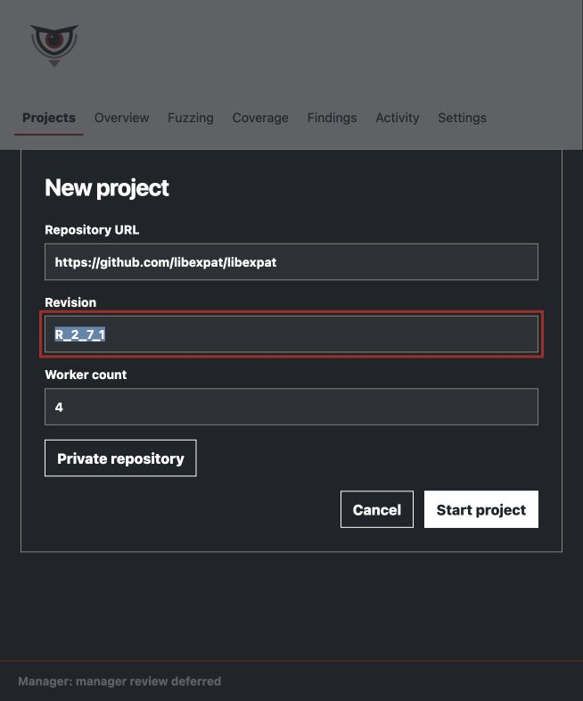
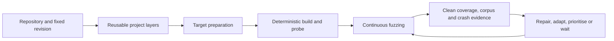
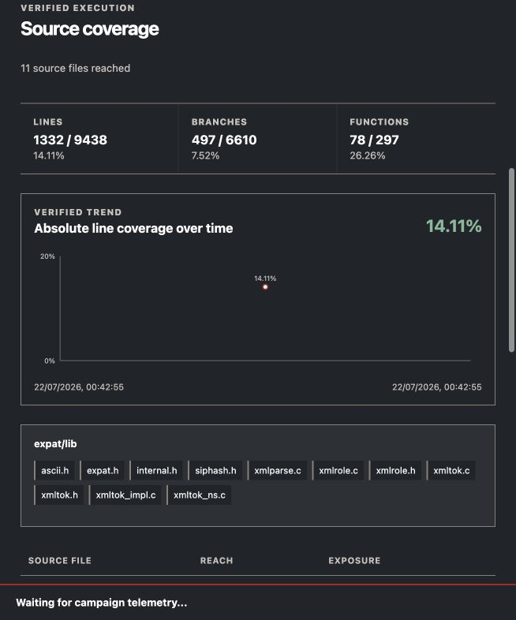
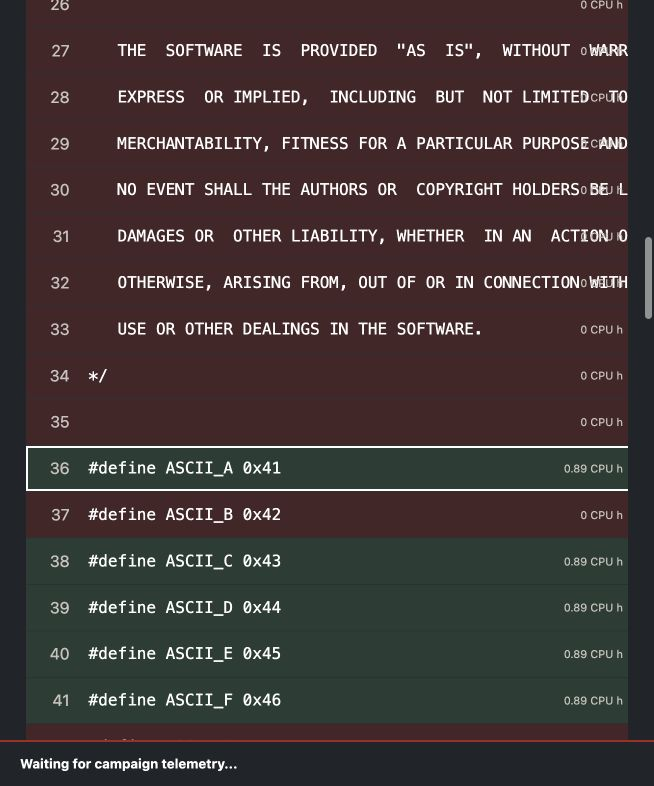

# BigEye

> **An autonomous fuzzing campaign manager that turns a source repository into a continuously managed, inspectable security campaign.**

<p align="center">
  
</p>

BigEye is not a new fuzzing engine. It manages AFL++ and libFuzzer for maintainers, security researchers, product-security engineers and application-security teams that need useful fuzzing to continue after the first harness has been generated.

Traditional fuzzing automation often stops after producing a compilable harness. A real campaign still requires someone to interpret weak coverage, repair targets after runtime feedback, improve corpora, change configurations when progress stalls, investigate unreachable code, remove redundant work and distinguish product defects from harness mistakes. The fuzzer process can run unattended; the testing strategy usually cannot.

BigEye automates that continuing strategy. Give it an HTTP(S) Git repository and an exact branch, tag or revision. It resolves the commit once, prepares reusable `linux/amd64` build layers, creates evidence-backed campaigns and keeps adapting them as verified coverage and crash evidence arrives.

BigEye is a single-user application that runs locally on macOS or Linux. The FastAPI backend and React interface run on the host. Docker is used only for PostgreSQL and isolated build, fuzzing, replay and coverage jobs.

## Contents

- [Component and whole-system campaigns](#component-and-whole-system-campaigns)
- [Demo](#demo)
- [Getting started](#getting-started)
- [What BigEye does](#what-bigeye-does)
- [How BigEye manages a campaign](#how-bigeye-manages-a-campaign)
- [How GPT-5.6 and Codex were used](#how-gpt-56-and-codex-were-used)
- [Platform comparison](#platform-comparison)
- [Supported platforms and prerequisites](#supported-platforms-and-prerequisites)
- [Licence](#licence)

## Component and whole-system campaigns

BigEye uses two complementary campaign types:

- **Component-level fuzzing** uses libFuzzer to exercise a library, parser or standalone component in-process. It is useful for code that a complete application cannot reach efficiently.
- **Whole-system fuzzing** uses AFL++ against a real executable. It preserves behaviour that depends on command-line configuration, protocol state, file formats, multiple interacting components or optional features. BigEye can run distinct configurations in parallel when one executable exposes materially different behaviour through flags or build options.

The execution engine is secondary to the campaign objective. BigEye decides what evidence-backed work is useful, prepares and repairs it incrementally, and measures both campaign types against clean source builds.

## Demo

> **Video demo placeholder:** a public, voice-over YouTube link of less than three minutes will be added before the OpenAI Build Week submission.

## Getting started

Requirements: Python 3.14, Node.js `^20.19.0 || >=22.12.0`, Git, Docker and Docker Compose v2.

```sh
git clone https://github.com/marcellomaugeri/BigEye.git
cd BigEye
cp .env_example .env
```

Set `OPENAI_API_KEY` in `.env`, then run:

```sh
scripts/setup.sh
scripts/start.sh
```

BigEye opens at [http://127.0.0.1:8000/](http://127.0.0.1:8000/). On a Linux host without a desktop session, use `scripts/start.sh --no-browser`.

### Start a campaign

Select **+ New project** and provide a public HTTP(S) Git repository, an exact branch, tag or commit, and the maximum number of concurrent compilation or fuzzing jobs. A project-specific read-only token can be supplied for a private repository.

<p align="center">
  
</p>

#### Recommended demonstration project

For a short demonstration, create a project with:

- **Repository:** `https://github.com/libexpat/libexpat`
- **Revision:** `R_2_7_1`
- **Concurrent jobs:** `4`

Expat is a compact C XML parser with existing component-level fuzzing entry points and the `xmlwf` command-line executable. Its focused codebase and build configuration make it an accessible third-party project for demonstrating BigEye. An approximately one-hour run can show repository preparation, target selection, deterministic build and probe validation, clean coverage compilation and live campaign activity. Exact coverage and findings depend on the available compute and the evidence discovered during that run.

After submission, BigEye starts automatically. The first campaign can take time: BigEye must understand the repository, prepare cached project layers, compile both the fuzzing and clean-coverage variants, and probe each target before allowing it to run continuously.

## What BigEye does

- Resolves an immutable repository revision and preserves the commit throughout the campaign.
- Chooses evidence-backed entry paths instead of treating every function as an equally useful target.
- Runs whole-system AFL++ campaigns and component-level libFuzzer campaigns.
- Generates and incrementally repairs harnesses, build configuration, patches and initial corpora without modifying the source checkout.
- Starts with compatible ASan and UBSan instrumentation and validates every target with a deterministic probe.
- Monitors coverage, corpus opportunities, campaign health and plateaux, then wakes the manager only when a decision is useful.
- Measures clean-build line, function and branch coverage, retains first-hit testcases and attributes cumulative container CPU exposure to reached source.
- Minimises corpora, detects overlapping strategies and avoids redundant work while preserving finding reproduction.
- Replays, minimises, fingerprints and groups crashes before classifying and prioritising findings.
- Exposes project activity, model and tool traces, build and fuzzer logs, campaign rationale, coverage evidence and findings through one local interface.

## How BigEye manages a campaign



1. **Fix the source identity.** BigEye resolves the requested revision to one commit and keeps the checkout immutable.
2. **Prepare reusable layers.** The maintained toolchain, repository and project dependencies are cached independently so a small target change does not rebuild everything.
3. **Select bounded work.** The manager assigns independent questions such as preparing an entry path, repairing a failed build or investigating weak reach.
4. **Validate before promotion.** Deterministic services compile each proposal and run a bounded probe. A model statement never proves that a target works.
5. **Run continuously.** Validated whole-system and component campaigns run as ordinary fuzzer processes, not as agents.
6. **Measure clean evidence.** Corpus inputs are replayed against a separate clean build to collect line, function and branch coverage without fuzzing-only instrumentation or patches distorting the result.
7. **Adapt only when useful.** New reach, a plateau, a failed target, useful corpus evidence, sustained overlap, a replayed crash or the manager's chosen deadline can trigger another review. Healthy fuzzers continue without model polling.
8. **Present findings, not raw crashes.** BigEye replays, minimises, fingerprints and groups crashes before classifying uncertainty, assigning priority and retaining a reproducible input.

### Reusable build layers

1. A maintained base image contains LLVM 18, Clang, libFuzzer, AFL++ 4.40c and coverage tooling.
2. A repository layer contains the exact resolved commit.
3. Dependency and project-build layers are reused while their inputs remain unchanged.
4. Target layers contain generated harnesses, patches, configuration and seeds.
5. A separate clean-coverage layer measures the unmodified source path.

Every image build and campaign container explicitly requests `linux/amd64`. BigEye does not use OSS-Fuzz or OSS-Fuzz-Gen images or source code.

### Inspectable evidence

- **Overview** presents current focus, active strategies, replayed findings and measured source reach.
- **Fuzzing** shows each target and configuration, current activity, recent coverage movement, total reach and CPU exposure.
- **Coverage** connects covered lines to reaching strategies and the first retained testcase for each target.
- **Findings** presents grouped replay evidence, priority, uncertainty, a minimal input and contained reproduction output.
- **Activity** records decisions, motivations, tool calls, model usage and sanitised runtime logs.

The Overview separates clean whole-project coverage from campaign-only reach and plots absolute line coverage over time.

<p align="center">
  
</p>

The Coverage view highlights covered and uncovered source lines while retaining the CPU exposure and first testcase needed to inspect reproducibility.

<p align="center">
  
</p>

CPU exposure is cumulative container CPU time attributed to lines reached by a campaign's clean-coverage replay. It is not wall-clock time and does not imply that every path through a line was tested.

## How GPT-5.6 and Codex were used

### For development

The project began in a separate brainstorming chat. I supplied the original intention in a document and asked Codex to challenge it through up to 200 explicit clarification questions covering scope, user journeys, agents, fuzzing infrastructure, technology and file organisation. The first implementation pass then ran continuously for 18 hours with GPT-5.6 Sol at Extra High reasoning effort.

Development used Jesse Vincent's [Superpowers](https://github.com/obra/superpowers) plugin:

- [Writing Plans](https://github.com/obra/superpowers/blob/main/skills/writing-plans/SKILL.md) translated approved decisions into explicit, file-specific tasks before implementation.
- [Test-Driven Development](https://github.com/obra/superpowers/blob/main/skills/test-driven-development/SKILL.md) required behaviour changes to begin with a test that demonstrated the missing behaviour, followed by the smallest implementation and a confirming test run.
- [Subagent-Driven Development](https://github.com/obra/superpowers/blob/main/skills/subagent-driven-development/SKILL.md) assigned focused implementation and review work to separate agents so independent modules could progress in parallel.

Codex supplied the development environment and multi-agent tools; GPT-5.6 reasoned through and executed the implementation and review work. These development workflows are separate from BigEye's runtime agents.

### In the project

- **GPT-5.6 Terra** manages one project's long-running campaign and decides which bounded work is useful next.
- **GPT-5.6 Luna** performs the first bounded worker attempt; genuinely difficult work can be escalated to Terra.
- **OpenAI Agents SDK** supplies typed agents, structured outputs, tracing and `Agent.as_tool()` as the delegation boundary.
- Independent target or investigation assignments can run in parallel, while edits to the same generated asset remain serial and incremental.
- Agents handle source interpretation and technical judgement. Repository cloning, builds, probes, fuzzing, coverage, corpus processing, replay, grouping, scheduling and wake deadlines remain deterministic application services.
- Fuzzer processes are not agents and do not consume model tokens while they run.

## Platform comparison

| Platform | Harness generation | Harness repair after runtime feedback | Whole-system fuzzing | Explains why specific code stays unreached | Stops or changes work when progress stalls | Real bug vs harness error | Finding prioritisation | Open source |
|---|:---:|:---:|:---:|:---:|:---:|:---:|:---:|:---:|
| [OSS-Fuzz-Gen](https://github.com/google/oss-fuzz-gen) | ✅ | ✅ | ❌ | ✅ | ❌ | ❌ | ❌ | ✅ |
| [PromeFuzz](https://github.com/TCA-ISCAS/PromeFuzz-ccs-2025) | ✅ | ❌ | ❌ | ❌ | ❌ | ✅ | ❌ | ✅ |
| [FuzzAgent](https://arxiv.org/abs/2605.14431) | ✅ | ✅ | ❌ | ✅ | ✅ | ✅ | ❌ | ❌ |
| [CI Fuzz](https://www.code-intelligence.com/product-ci-fuzz/ci-fuzz-vs-libfuzzer-afl-hongfuzz) | ✅ | ❌ | ✅ | ❌ | ✅ | ❌ | ✅ | ❌ |
| **BigEye** | ✅ | ✅ | ✅ | ✅ | ✅ | ✅ | ✅ | ✅ |


The table compares fuzzing platforms and campaign-management systems, not execution engines. A cross does not mean that a platform is technically incapable of supporting the behaviour. BigEye's distinction is the integration of component and whole-system execution, runtime-driven repair, investigation of unreached code, campaign adaptation, classification of harness-induced failures and finding prioritisation into one inspectable repository-level campaign. Open-source availability strengthens the accessibility of that workflow; it is not the principal technical difference.

## Supported platforms and prerequisites

BigEye supports macOS with Docker Desktop and Linux with Docker Engine and Docker Compose v2. Windows is not supported.

Required host tools:

- Python 3.14 available as `python3.14`;
- Node.js `^20.19.0 || >=22.12.0` with npm;
- Git;
- Docker with Compose v2 and a builder that supports `linux/amd64`.

The LLVM-based pipeline is designed for LLVM-compatible targets and is currently validated with controlled C/C++ fixtures. BigEye remains a local, single-user release rather than a hosted multi-tenant service. See [release verification](docs/release-verification.md) for the exact observed evidence and pending external-project and Linux-host boundaries.

## Licence

BigEye is available under the [Apache License 2.0](LICENSE).

## Personal note

BigEye began as a project I designed some time ago but never found the right moment to implement. I would like to thank a very close friend for giving me the excuse to finally work on it.

If BigEye wins, I would like to allocate all of the prize funds to support her studies, as she is struggling to pursue her dream career. Helping her continue that journey would mean more to me than any personal prize.
