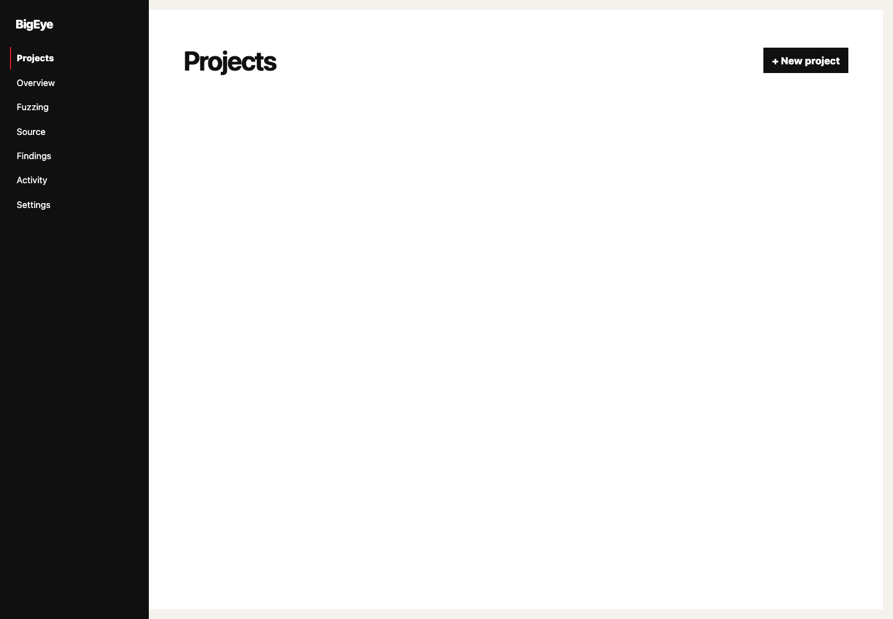
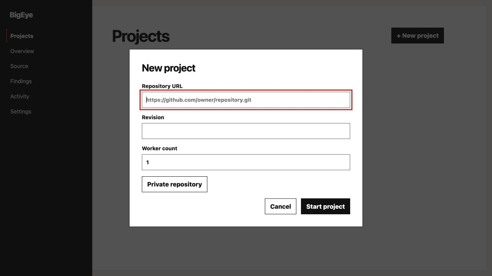
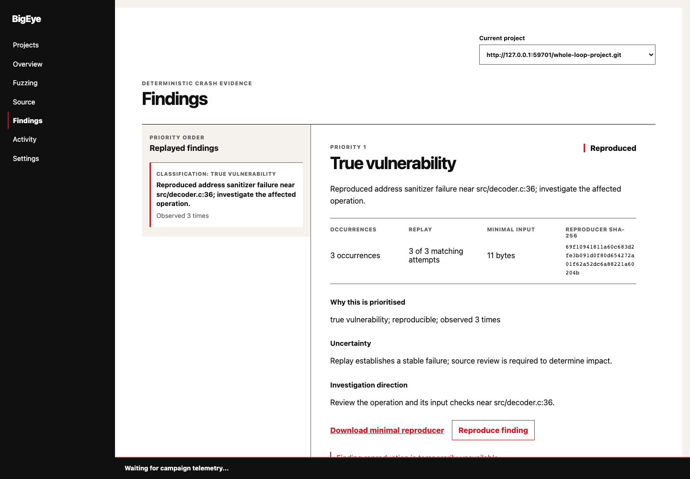

# BigEye

**An autonomous fuzz tester that turns a source repository into a continuously managed, inspectable security campaign.**

Traditional fuzzing is powerful, but preparing a useful campaign is specialist work. A tester must understand the codebase, choose reachable targets, build or repair harnesses, prepare seeds, select instrumentation, monitor coverage, distinguish real defects from harness mistakes, and keep reallocating finite compute. The fuzzer can run unattended; the testing strategy usually cannot.

BigEye automates that strategy. Give it an HTTP(S) Git repository and an exact branch, tag or revision. It resolves the commit once, prepares reusable `linux/amd64` build layers, creates evidence-backed system and component campaigns, and keeps working as new coverage and crash evidence arrives.

BigEye is a single-user application that runs locally on macOS or Linux. The FastAPI backend and React interface run on the host. Docker is used only for PostgreSQL and isolated build, fuzzing, replay and coverage jobs.

## Demo

> **Video demo placeholder:** a public, voice-over YouTube link of less than three minutes will be added before the OpenAI Build Week submission.

<p align="center">
  
</p>

The product opens on a deliberately quiet Projects view. A new campaign needs only a repository, a fixed revision and a maximum number of concurrent compilation or fuzzing jobs.

<p align="center">
  
</p>

<p align="center">
  
</p>

BigEye does not present every crashing input as a vulnerability. Candidates are replayed, minimised, grouped and classified before they become findings. The view below comes from a controlled end-to-end fixture and shows three occurrences grouped into one replayed finding with a minimal reproducer and an explicit investigation direction.

<p align="center">
  
</p>

## What BigEye does

- Resolves an immutable repository revision and preserves the commit throughout the campaign.
- Chooses evidence-backed entry paths instead of treating every function as an equally useful target.
- Runs **system-level campaigns** with a pinned AFL++ toolchain and **component-level campaigns** with libFuzzer.
- Generates and incrementally repairs harnesses, build configuration, patches and initial corpora without modifying the source checkout.
- Starts with compatible ASan and UBSan instrumentation, validates every target with a deterministic probe, and keeps healthy fuzzers running without model polling.
- Monitors coverage, corpus opportunities, campaign health and plateaux, then wakes the manager only when a decision is useful.
- Measures clean-build line, function and branch coverage, retains first-hit testcases for reproducibility, and attributes cumulative container CPU exposure to reached source.
- Minimises corpora, detects overlapping strategies and avoids scheduling redundant work while preserving evidence needed to reproduce findings.
- Replays, minimises, fingerprints and groups crashes before classifying them as harness-induced false positives, improper contract usage, true vulnerabilities, flaky or environmental failures, or unresolved evidence.
- Exposes project activity, model/tool traces, build and fuzzer logs, campaign rationale, coverage evidence and findings through one local interface. Secrets are redacted and private chain-of-thought is never exposed.

## How it works

```mermaid
flowchart LR
    U["Repository and fixed revision"] --> P["Deterministic project preparation"]
    P --> M["GPT-5.6 Terra campaign manager"]
    M -->|"Agent.as_tool() bounded assignments"| W["GPT-5.6 Luna fuzzing workers"]
    W --> A["Validated target and operation requests"]
    A --> S["Deterministic BigEye services"]
    S --> D["Cached linux/amd64 Docker layers"]
    D --> F["AFL++ and libFuzzer processes"]
    F --> E["Coverage, corpus and crash evidence"]
    E --> M
    E --> UI["Overview, Fuzzing, Source, Findings and Activity"]
```



The manager owns one durable objective: improve verified, security-relevant coverage of the selected commit within the project's worker limit. It sees bounded evidence summaries and delegates independent questions in parallel through one typed worker tool. Workers receive one granular assignment, such as preparing a target, repairing a build, investigating a plateau, improving a corpus or triaging replay evidence.

Workers can navigate bounded repository paths, retrieve local evidence, search selected official documentation, create generated assets and request contained operations. They cannot edit the immutable checkout, use a host shell, control Docker directly or dispatch more agents. Application services validate the structured output, execute accepted build/probe/replay/coverage work, and reject unsupported claims or paths.

Fuzzer processes are not agents. They run continuously and cheaply inside containers. Deterministic wake rules call the manager again when a target is unhealthy, a worker slot becomes useful, coverage plateaus, a corpus opportunity appears, a crash has been replayed, or the manager's chosen review time arrives. A watchdog recovers overdue reviews, so a temporary sleep cannot silently stop the campaign.

### Reusable build layers

BigEye avoids rebuilding an entire project after every small change:

1. A maintained base image contains LLVM 18, Clang, libFuzzer, AFL++ 4.40c and the coverage tooling.
2. A repository layer clones the exact resolved commit.
3. Dependency and project-build layers are reused while their inputs remain unchanged.
4. Target layers contain generated harnesses, patches, configuration and seeds.
5. A separate clean-coverage layer measures the unmodified source path so fuzzing-only patches do not distort reported coverage.

Every image build and campaign container explicitly requests `linux/amd64`. BigEye does not use OSS-Fuzz or OSS-Fuzz-Gen images or source code.

### Campaign evidence and traceability

The interface separates what the model proposes from what BigEye has actually verified:

- **Overview** presents current focus, active strategies, replayed findings and measured source reach.
- **Fuzzing** shows each harness/configuration, its engine as secondary metadata, current activity, recent coverage movement, total reach and CPU exposure.
- **Source** connects covered lines to reaching strategies and the retained first testcase for each harness.
- **Findings** presents grouped replay evidence, priority, uncertainty, a minimal input and a contained reproduction stream.
- **Activity** records decisions, motivations, tool calls, model usage, contained work and sanitised logs.

CPU exposure is cumulative container CPU time attributed to lines reached by a campaign's clean-coverage replay. It is not wall-clock time and does not imply that every path through a line was tested.

## Why GPT-5.6 and Codex

BigEye uses agents only for work that needs judgement. Repository cloning, builds, probes, scheduling limits, corpus admission, coverage collection, replay, minimisation, grouping and wake-up timing are deterministic application services.

- **GPT-5.6 Terra** is the project manager. Its parallel tool calls let it assign independent target or investigation work in one review while keeping the overall campaign coherent.
- **GPT-5.6 Luna** handles the first bounded worker attempt. A task can be escalated to Terra only when the worker explicitly reports that the bounded assignment exceeds Luna's capability; transport, authentication and quota errors are not treated as reasoning difficulty.
- **OpenAI Agents SDK** provides typed agents, structured outputs, tracing and `Agent.as_tool()`. The manager never receives repository, shell or Docker access directly.
- **Codex** accelerated the project from architecture to a working vertical slice: decomposing the agent and deterministic-service boundary, implementing the FastAPI/React product, developing the reusable Docker layers, building controlled fuzzing fixtures, writing tests, debugging complete campaign runs, and refining the UI and release documentation.

Three decisions shaped the implementation:

1. **Agents are decision-makers, not fuzzer processes.** Healthy fuzzers keep running without spending model tokens.
2. **Model output is a proposal, not evidence.** BigEye promotes only targets, coverage and findings that pass deterministic validation.
3. **Repair is incremental.** A worker changes the smallest broken harness, seed, patch or configuration instead of regenerating a working campaign from the beginning.

## Platform comparison

| Platform | Automated target and configuration selection | Harness generation and repair | Continuous autonomous campaigns | Automated crash triage | Open source |
|---|:---:|:---:|:---:|:---:|:---:|
| [PromeFuzz](https://github.com/TCA-ISCAS/PromeFuzz-ccs-2025) | ✅ | ✅ | ❌ | ✅ | ✅ |
| [FuzzAgent](https://arxiv.org/abs/2605.14431) | ✅ | ✅ | ✅ | ✅ | ❌ |
| [CI Fuzz](https://www.code-intelligence.com/product-ci-fuzz/ci-fuzz-vs-libfuzzer-afl-hongfuzz) | ✅ | ✅ | ✅ | ✅ | ❌ |
| **BigEye** | ✅ | ✅ | ✅ | ✅ | ✅ |

✅ Supported &nbsp;&nbsp; ❌ Not supported

This table compares campaign-management platforms, not fuzzing engines. BigEye uses AFL++ and libFuzzer as execution engines underneath its autonomous workflow.

## Supported platforms and prerequisites

BigEye supports:

- macOS with Docker Desktop;
- Linux with Docker Engine and Docker Compose v2.

Only macOS and Linux hosts are supported. Install these host prerequisites before setup:

- Python 3.14 available as `python3.14`;
- Node.js `^20.19.0 || >=22.12.0` with npm, as required by Vite 8;
- Git;
- Docker with Compose v2 and a builder that supports `linux/amd64`.

The setup script verifies prerequisites and reports missing tools. It does not install system packages.

## Getting started

Clone this release branch and enter the repository:

```sh
git clone https://github.com/marcellomaugeri/BigEye.git
cd BigEye
git switch codex/bigeye-backbone
```

### 1. Configure the local environment

```sh
cp .env_example .env
```

Add your OpenAI API key to `.env`:

```dotenv
OPENAI_API_KEY=your_key_here
```

The file is ignored by Git. BigEye loads it automatically and never copies the key into the frontend or fuzzer containers.

### 2. Install project dependencies

```sh
scripts/setup.sh
```

The script creates `backend/.venv` with Python 3.14, installs the frozen Python dependencies, runs `npm ci`, starts PostgreSQL, checks the database schema and verifies Docker's `linux/amd64` support. The maintained fuzzing image and later target layers are cached and reused.

### 3. Start BigEye

```sh
scripts/start.sh
```

The command loads `.env`, builds the production frontend, health-checks PostgreSQL and serves BigEye at [http://127.0.0.1:8000/](http://127.0.0.1:8000/). It normally opens the page once the API is ready.

Use the following command on a Linux host without a desktop session:

```sh
scripts/start.sh --no-browser
```

Use `--port PORT` to select another loopback port. BigEye intentionally has no non-loopback bind option.

### 4. Start a campaign

Select **+ New project** and provide:

- a public HTTP(S) Git repository URL;
- an exact branch, tag or commit;
- the maximum concurrent compilation or fuzzing jobs, which defaults to four;
- optionally, a project-specific read-only token for a private repository.

The job limit applies to heavy Docker work, not to independent model analysis. BigEye resolves the revision, prepares the repository and starts its first useful campaigns automatically.

Press Ctrl-C to stop the host backend gracefully. PostgreSQL and labelled campaign containers remain available for recovery. Stop PostgreSQL explicitly when desired:

```sh
docker compose stop postgres
```

## Testing

For a fast judge/developer path that does not run a new live campaign:

```sh
scripts/check.sh
```

This checks the frozen Python environment, Compose configuration, backend behaviour, frontend tests, TypeScript and the production frontend build. Docker's layer cache prevents unchanged toolchain and project layers from being rebuilt.

Real Docker campaign tests are opt-in because they compile and run fuzzers:

```sh
scripts/check.sh --live-docker
```

The checked-in controlled fixtures exercise system and component targets, clean coverage, crash grouping, deterministic reproduction and recovery without depending on an external project. Live manager tests additionally require a valid OpenAI key and API credit.

See [release verification](docs/release-verification.md) for the exact evidence observed on this revision and the remaining live rerun boundary.

## Project structure

```text
backend/
├── agents/       # manager, workers, prompts, typed outputs and bounded tools
├── api/          # FastAPI controllers and response views
├── database/     # PostgreSQL connection and development schema
├── fuzzing/      # images, layers, engines, campaigns, coverage, corpus and crashes
├── models/       # minimal application state
├── repositories/ # PostgreSQL queries
├── services/     # project, campaign, finding and observability operations
└── tests/        # deterministic and opt-in live tests

frontend/src/
├── components/   # focused visual components
├── controllers/  # view state and user actions
├── models/       # API data shapes
├── services/     # HTTP and server-sent-event clients
└── views/        # Projects, Overview, Fuzzing, Source, Findings, Activity, Settings

workspace/        # ignored PostgreSQL data, repositories, assets, corpora and evidence
```

## Data and security boundaries

PostgreSQL stores structured application state under `workspace/postgres`. Repository clones, generated assets, corpora, reproducers, coverage evidence and sanitised logs stay under `workspace/projects/<project-id>`. The entire workspace and `.env` are ignored by Git.

The OpenAI key remains in the host process environment. Repository tokens are project-specific and used only for contained Git authentication; they are not returned by the API, placed in Docker layers, exposed to the frontend or written to logs. This local MVP stores the token without production-grade encryption, so use a narrowly scoped read-only token.

Repositories, build output, testcases, crash records and web pages are treated as untrusted evidence. Generated paths are contained, checkout traversal and `.git` access are rejected, commands are validated as shell-free argument vectors, and agents never receive a raw Docker client or general host shell.

## Current scope

BigEye is a local, single-user MVP rather than a hosted multi-tenant service. Its LLVM-based pipeline is designed around LLVM-compatible targets and is currently validated with C/C++ controlled fixtures. A full external-project campaign still depends on that repository's buildability, available compute and OpenAI API access.

Observed local evidence includes real AFL++ and libFuzzer target preparation, exact clean line/function/branch coverage, first-hit corpus admission, grouped deterministic crash replay, a prioritised finding, contained reproduction and campaign recovery. The final browser-driven rerun after the latest fixes remains pending because no API credits were available; the README does not present that gate as complete.

## Licence

BigEye is available under the [Apache License 2.0](LICENSE).

## Personal note

BigEye began as a project I designed some time ago but never found the right moment to implement. I would like to thank a very close friend for giving me the excuse to finally work on it.

If BigEye wins, I would like to allocate all of the prize funds to support her studies, as she is struggling to pursue her dream career. Helping her continue that journey would mean more to me than any personal prize.
